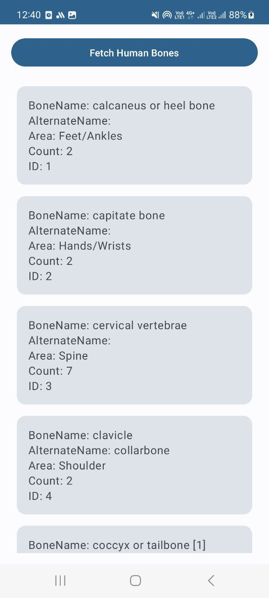

# Цель работы

Реализовать мобильное приложение выполняющее разбор данных в формате JSON получаемых по протоколу HTTP.

# Вариант 6

https://mysafeinfo.com/api/data?list=humanbones&format=json

# Реализация

Исходный код MainActivity.kt:
```kotlin
package com.example.k2

import android.os.Bundle
import androidx.activity.ComponentActivity
import androidx.activity.compose.setContent
import androidx.activity.viewModels
import androidx.compose.foundation.layout.Column
import androidx.compose.foundation.layout.Spacer
import androidx.compose.foundation.layout.fillMaxSize
import androidx.compose.foundation.layout.fillMaxWidth
import androidx.compose.foundation.layout.height
import androidx.compose.foundation.layout.padding
import androidx.compose.foundation.lazy.LazyColumn
import androidx.compose.foundation.lazy.items
import androidx.compose.material3.Button
import androidx.compose.material3.Card
import androidx.compose.material3.MaterialTheme
import androidx.compose.material3.Surface
import androidx.compose.material3.Text
import androidx.compose.runtime.Composable
import androidx.compose.runtime.getValue
import androidx.compose.ui.Modifier
import androidx.compose.ui.tooling.preview.Preview
import androidx.compose.ui.unit.dp
import com.example.k2.ui.theme.K2Theme
import retrofit2.Retrofit
import retrofit2.converter.gson.GsonConverterFactory
import retrofit2.http.GET
import androidx.lifecycle.ViewModel
import androidx.lifecycle.viewModelScope
import kotlinx.coroutines.launch
import androidx.compose.runtime.mutableStateOf
import com.google.gson.annotations.SerializedName

data class HumanBone(
    @SerializedName("BoneName")
    val boneName: String,
    @SerializedName("AlternateName")
    val alternateName: String,
    @SerializedName("Area")
    val area: String,
    @SerializedName("Count")
    val count: Int,
    @SerializedName("ID")
    val id: Int,
)


class MainViewModel : ViewModel() {
    val bones = mutableStateOf<List<HumanBone>>(emptyList())
    val errorMessage = mutableStateOf("")

    fun fetchHumanBones() {
        viewModelScope.launch {
            try {
                bones.value = RetrofitInstance.api.getHumanBones()
            } catch (e: Exception) {
                errorMessage.value = "Error: ${e.message}"
            }
        }
    }
}


interface ApiService {
    @GET("data?list=humanbones&format=json")
    suspend fun getHumanBones(): List<HumanBone>
}

object RetrofitInstance {
    private const val BASE_URL = "https://mysafeinfo.com/api/"

    val api: ApiService by lazy {
        Retrofit.Builder()
            .baseUrl(BASE_URL)
            .addConverterFactory(GsonConverterFactory.create())
            .build()
            .create(ApiService::class.java)
    }
}

class MainActivity : ComponentActivity() {

    val viewModel: MainViewModel by viewModels()

    override fun onCreate(savedInstanceState: Bundle?) {
        super.onCreate(savedInstanceState)
        setContent {
            K2Theme {
                Surface(
                    modifier = Modifier.fillMaxSize(),
                    color = MaterialTheme.colorScheme.background
                ) {
                    MainScreen()
                }
            }
        }
    }

    @Composable
    fun MainScreen() {
        val bones by viewModel.bones
        val errorMessage by viewModel.errorMessage

        Column(modifier = Modifier
            .fillMaxSize()
            .padding(16.dp)) {
            Button(onClick = { viewModel.fetchHumanBones() }, modifier = Modifier.fillMaxWidth()) {
                Text("Fetch Human Bones")
            }

            Spacer(modifier = Modifier.height(16.dp))

            if (errorMessage.isNotEmpty()) {
                Text(errorMessage)
            }

            LazyColumn(modifier = Modifier.fillMaxSize()) {
                items(bones) { bone ->
                    Card(modifier = Modifier
                        .fillMaxWidth()
                        .padding(8.dp)) {
                        Column(modifier = Modifier.padding(16.dp)) {
                            Text("BoneName: ${bone.boneName}")
                            Text("AlternateName: ${bone.alternateName}")
                            Text("Area: ${bone.area}")
                            Text("Count: ${bone.count}")
                            Text("ID: ${bone.id}")
                        }
                    }
                }
            }
        }
    }
}

```

# Результаты

{width=5cm}

# Вывод

В ходе выполнения данной работы было успешно реализовано мобильное приложение, выполняющее разбор данных в формате JSON, получаемых по протоколу HTTP.