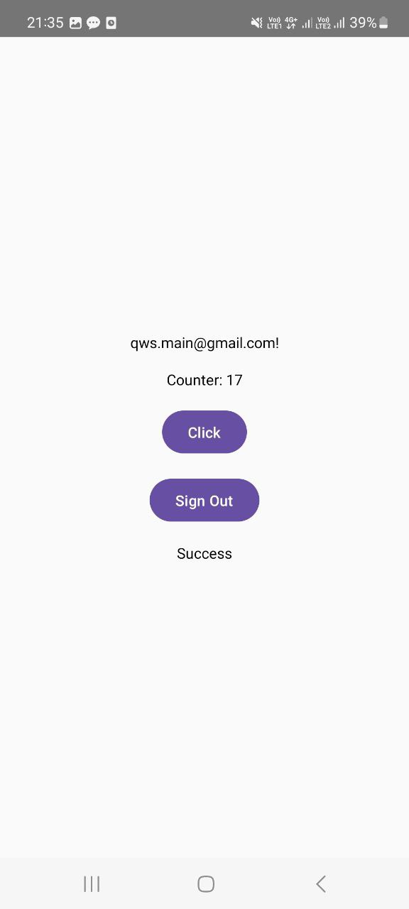

# Цель работы

Научиться реализовывать аутентификацию пользователей и работать с данными в Firebase Realtime Database.

# Реализация

Исходный код MainActivity.kt:
```kotlin
package com.example.k3

import android.os.Bundle
import androidx.activity.ComponentActivity
import androidx.activity.compose.setContent
import androidx.compose.foundation.layout.Arrangement
import androidx.compose.foundation.layout.Column
import androidx.compose.foundation.layout.Spacer
import androidx.compose.foundation.layout.fillMaxSize
import androidx.compose.foundation.layout.fillMaxWidth
import androidx.compose.foundation.layout.height
import androidx.compose.foundation.layout.padding
import androidx.compose.material3.Button
import androidx.compose.material3.ExperimentalMaterial3Api
import androidx.compose.material3.MaterialTheme
import androidx.compose.material3.Surface
import androidx.compose.material3.Text
import androidx.compose.material3.TextField
import androidx.compose.runtime.Composable
import androidx.compose.runtime.LaunchedEffect
import androidx.compose.runtime.getValue
import androidx.compose.runtime.mutableStateOf
import androidx.compose.runtime.remember
import androidx.compose.runtime.setValue
import androidx.compose.ui.Alignment
import androidx.compose.ui.Modifier
import androidx.compose.ui.text.input.PasswordVisualTransformation
import androidx.compose.ui.unit.dp
import com.google.firebase.auth.FirebaseAuth
import com.google.firebase.database.FirebaseDatabase

class MainActivity : ComponentActivity() {
    override fun onCreate(savedInstanceState: Bundle?) {
        super.onCreate(savedInstanceState)
        setContent {
            val firebaseAuth = FirebaseAuth.getInstance()
            val database = FirebaseDatabase.getInstance()
            AuthScreen(firebaseAuth, database)
        }
    }
}

@OptIn(ExperimentalMaterial3Api::class)
@Composable
fun AuthScreen(firebaseAuth: FirebaseAuth, database: FirebaseDatabase) {
    var email by remember { mutableStateOf("") }
    var password by remember { mutableStateOf("") }
    var message by remember { mutableStateOf("") }
    var isLoggedIn by remember { mutableStateOf(false) }
    var counter by remember { mutableStateOf(0) }

    val userId = firebaseAuth.currentUser?.uid

    LaunchedEffect(isLoggedIn) {
        if (isLoggedIn && userId != null) {
            val counterRef = database.getReference("users/$userId/counter")
            counterRef.get().addOnSuccessListener { snapshot ->
                counter = snapshot.getValue(Int::class.java) ?: 0
            }
        }
    }

    Column(
        modifier = Modifier
            .fillMaxSize()
            .padding(16.dp),
        horizontalAlignment = Alignment.CenterHorizontally,
        verticalArrangement = Arrangement.Center
    ) {
        if (!isLoggedIn) {
            TextField(
                value = email,
                onValueChange = { email = it },
                label = { Text("Email") },
                modifier = Modifier.fillMaxWidth()
            )

            Spacer(modifier = Modifier.height(8.dp))

            TextField(
                value = password,
                onValueChange = { password = it },
                label = { Text("Password") },
                modifier = Modifier.fillMaxWidth(),
                visualTransformation = PasswordVisualTransformation()
            )

            Spacer(modifier = Modifier.height(16.dp))

            Button(onClick = {
                signIn(email, password) { success, error ->
                    if (success) {
                        message = "Success"
                        isLoggedIn = true
                    } else {
                        message = error ?: "Sign In Error"
                    }
                }
            }) {
                Text("Sign In")
            }

            Spacer(modifier = Modifier.height(8.dp))
            Button(onClick = {
                signUp(email, password) { success, error ->
                    message = if (success) {
                        "Registered successfully! Please log in."
                    } else {
                        error ?: "Sign Up Error"
                    }
                }
            }) {
                Text("Sign Up")
            }
        } else {
            Text(text = "${firebaseAuth.currentUser?.email}!")
            Spacer(modifier = Modifier.height(16.dp))

            Text(text = "Counter: $counter")
            Spacer(modifier = Modifier.height(16.dp))

            Button(onClick = {
                val counterRef = database.getReference("users/$userId/counter")
                counter++
                counterRef.setValue(counter)
            }) {
                Text("Click")
            }

            Spacer(modifier = Modifier.height(16.dp))

            Button(onClick = {
                signOut()
                isLoggedIn = false
                message = "Signed out successfully."
            }) {
                Text("Sign Out")
            }
        }

        Spacer(modifier = Modifier.height(16.dp))

        Text(text = message)
    }
}

fun signUp(email: String, password: String, onResult: (Boolean, String?) -> Unit) {
    FirebaseAuth.getInstance().createUserWithEmailAndPassword(email, password)
        .addOnCompleteListener { task ->
            if (task.isSuccessful) {
                onResult(true, null)
            } else {
                onResult(false, task.exception?.message)
            }
        }
}

fun signIn(email: String, password: String, onResult: (Boolean, String?) -> Unit) {
    FirebaseAuth.getInstance().signInWithEmailAndPassword(email, password)
        .addOnCompleteListener { task ->
            if (task.isSuccessful) {
                onResult(true, null)
            } else {
                onResult(false, task.exception?.message)
            }
        }
}

fun signOut() {
    FirebaseAuth.getInstance().signOut()
}
```

# Результаты

{width=5cm}

{width=5cm}

# Вывод

В ходе выполнения работы реализована авторизация пользователей, обновление данных счётчика в базе и взаимодействие с Firebase.