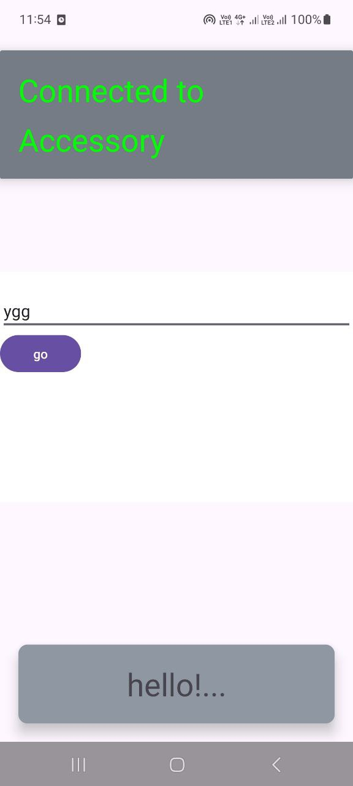
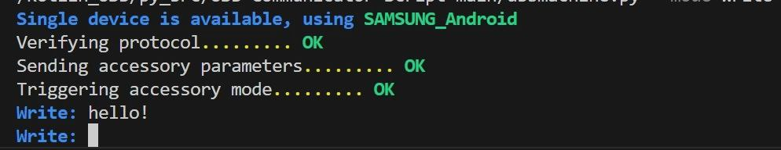
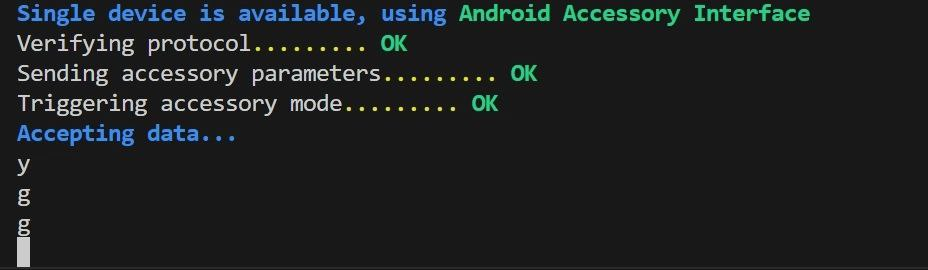

# Цель работы

Подключить смартфон к компьютеру через USB и реализовать обмен данными (write/read) с использованием Kotlin и Python.

# Реализация

Исходный код MainActivity.kt:
```kotlin
package com.example.usbcomm4

import android.content.Intent
import android.graphics.Color
import android.os.Bundle
import android.util.Log
import com.google.android.material.snackbar.Snackbar
import androidx.appcompat.app.AppCompatActivity
import androidx.navigation.findNavController
import androidx.navigation.ui.AppBarConfiguration
import androidx.navigation.ui.navigateUp
import androidx.navigation.ui.setupActionBarWithNavController
import android.view.Menu
import android.view.MenuItem
import android.view.View
import android.widget.EditText
import android.widget.TextView
import com.example.usbcomm4.databinding.ActivityMainBinding
import com.example.usbcommunicator.IUsbCallback
import com.example.usbcommunicator.UsbEngine
import java.nio.charset.StandardCharsets

class MainActivity : AppCompatActivity() {
    private val mCallback: IUsbCallback = object : IUsbCallback {
        override fun onConnectionEstablished() {
            val tv = findViewById<TextView>(R.id.textView)
            tv.text = usbEngine!!.connectionStatus()
            tv.setTextColor(Color.GREEN)
        }

        override fun onDeviceDisconnected() {
            val tv = findViewById<TextView>(R.id.textView)
            tv.text = usbEngine!!.connectionStatus()
            tv.setTextColor(Color.RED)
        }

        override fun onDataReceived(data: ByteArray?, num: Int) {
            val tv = findViewById<TextView>(R.id.textView2)
            if (data == null) {
                Log.d("App", "Received empty data!")
                return
            }
            var text = data.toString(StandardCharsets.UTF_8)
            Log.d("App", "Received: $text")
            if (text.length > 10) {
                text = text.substring(0, 10) + "..."
            }
            tv.text = text
        }
    }
    private var usbEngine: UsbEngine? = null
    override fun onCreate(savedInstanceState: Bundle?) {
        super.onCreate(savedInstanceState)
        setContentView(R.layout.activity_main)
        usbEngine = UsbEngine(applicationContext, mCallback)
        onNewIntent(this.intent)
        val editText = findViewById<EditText>(R.id.edit_text)
        findViewById<View>(R.id.go_button).setOnClickListener { it: View? -> usbEngine!!.write(editText.text.toString().toByteArray()) }
    }

    override fun onNewIntent(intent: Intent?) {
        super.onNewIntent(intent)
        usbEngine!!.onNewIntent(intent)
    }

    override fun onResume() {
        super.onResume()
        val intent = this.intent
        onNewIntent(intent)
    }
}
```

Исходный код activity_main.xml:
```xml
<?xml version="1.0" encoding="utf-8"?>
<androidx.coordinatorlayout.widget.CoordinatorLayout xmlns:android="http://schemas.android.com/apk/res/android"
    xmlns:app="http://schemas.android.com/apk/res-auto"
    xmlns:tools="http://schemas.android.com/tools"
    android:layout_width="match_parent"
    android:layout_height="match_parent"
    android:fitsSystemWindows="true"
    tools:context="com.example.usbcommunicator.MainActivity">

    <androidx.cardview.widget.CardView
        android:layout_width="match_parent"
        android:layout_height="wrap_content"
        android:layout_gravity="top"
        android:layout_marginVertical="20sp"
        app:cardBackgroundColor="#767C85"
        app:cardElevation="10sp"
        app:cardMaxElevation="10sp">

        <TextView
            android:id="@+id/textView"
            android:layout_width="match_parent"
            android:layout_height="wrap_content"
            android:layout_margin="20sp"
            android:layout_weight="2"
            android:lineSpacingExtra="14sp"
            android:text="Waiting for device..."
            android:textColor="#FFFFFF"
            android:textSize="34sp" />
    </androidx.cardview.widget.CardView>

    <LinearLayout
        android:layout_width="match_parent"
        android:layout_height="250sp"
        android:layout_gravity="center"
        android:layout_weight="1"
        android:background="#FFFFFF"
        android:orientation="vertical"
        android:paddingVertical="20sp">

        <EditText
            android:id="@+id/edit_text"
            android:layout_width="match_parent"
            android:layout_height="wrap_content"
            />
        <Button
            android:id="@+id/go_button"
            android:layout_width="wrap_content"
            android:layout_height="wrap_content"
            android:text="go"
            />

    </LinearLayout>

    <androidx.cardview.widget.CardView
        android:layout_width="match_parent"
        android:layout_height="wrap_content"
        android:layout_gravity="bottom"
        android:layout_margin="20sp"
        app:cardBackgroundColor="#8F97A3"
        app:cardCornerRadius="10dp"
        app:cardElevation="10sp"
        app:cardMaxElevation="10sp">

        <TextView
            android:id="@+id/textView2"
            android:layout_width="match_parent"
            android:layout_height="wrap_content"
            android:layout_gravity="bottom"
            android:layout_margin="20sp"
            android:ellipsize="end"
            android:text="No data received"
            android:textAlignment="center"
            android:textSize="34sp" />
    </androidx.cardview.widget.CardView>

</androidx.coordinatorlayout.widget.CoordinatorLayout>
```

Исходный код usbmachine.py:
```python
import os
import platform
import time
from dataclasses import dataclass, field
from enum import Enum
from typing import Optional
import serial, time
from serial.tools import list_ports

import typer
from rich.console import Console
import sys

import usb
from usb.core import Device, Endpoint

if platform.system() == 'Darwin' and 'arm' in platform.platform():
    os.environ['DYLD_LIBRARY_PATH'] = '/opt/homebrew/lib'


class AppMode(Enum):
    Write = 'write'
    Read = 'read'
    WriteArduino = 'write-arduino'


@dataclass
class App:
    device: Optional[Device] = None
    console: Optional[Console] = field(default_factory=Console)

    def select_device(self):
        lst: list[usb.Device] = list(usb.core.find(find_all=True))
        if not lst:
            self.console.print(r'[bold blue]Waiting for devices...')
            while not lst:
                lst = list(usb.core.find(find_all=True))
                time.sleep(1)

        if len(lst) == 1:
            dev = lst[0]
            self.console.print(fr'[bold blue]Single device is available, using [bold green]{usb.util.get_string(dev, dev.iProduct)}')
        else:
            self.console.print('[bold blue]Available devices:')
            for i, dev in enumerate(lst):
                self.console.print(f'  [bold green][{i}] {usb.util.get_string(dev, dev.iProduct)}')
            ind = self.console.input('[bold blue]Select device index: ')
            dev = lst[int(ind)]

        self.device = dev

    def prepare_device(self):
        for command_name, command in [
            ('Verifying protocol', self.set_protocol),
            ('Sending accessory parameters', self.send_accessory_parameters),
            ('Triggering accessory mode', self.set_accessory_mode),
        ]:
            self.console.print(f'{command_name}......... ', end='')
            try:
                command()
            except:
                self.console.print('[bold red]FAIL')
                self.console.print_exception()
                sys.exit(1)
            else:
                self.console.print('[bold green]OK')

    def set_protocol(self):
        try:
            self.device.set_configuration()
        except usb.core.USBError as e:
            if e.errno == 16:  # 16 == already configured
                pass
            raise

        ret = self.device.ctrl_transfer(0xC0, 51, 0, 0, 2)
        protocol = ret[0]
        if protocol < 2:
            raise ValueError(f'Protocol version {protocol} < 2 is not supported')
        return

    def send_accessory_parameters(self):
        def send_string(str_id, str_val):
            ret = self.device.ctrl_transfer(0x40, 52, 0, str_id, str_val, 0)
            if ret != len(str_val):
                raise ValueError('Received non-valid response')
            return

        send_string(0, 'dvpashkevich')
        send_string(1, 'PyAndroidCompanion')
        send_string(2, 'A Python based Android accessory companion')
        send_string(3, '0.1.0')
        send_string(4, 'https://github.com/alien-agent/USB-Communicator-Script')
        send_string(5, '0000-0000-0000')
        return

    def set_accessory_mode(self):
        ret = self.device.ctrl_transfer(0x40, 53, 0, 0, '', 0)
        if ret:
            raise ValueError('Failed to trigger accessory mode')
        time.sleep(1)

        # Must reconnect
        dev = usb.core.find()
        if not dev:
            raise ValueError('Device gone missing after accessory mode trigger, please restart')
        self.device = dev

        return

    def accept_data(self):
        self.console.print('[bold blue]Accepting data...')
        cfg = self.device.get_active_configuration()
        if_num = cfg[(0, 0)].bInterfaceNumber
        intf = usb.util.find_descriptor(cfg, bInterfaceNumber=if_num)

        ep_in: Endpoint = usb.util.find_descriptor(
            intf,
            custom_match= \
                lambda e: \
                    usb.util.endpoint_direction(e.bEndpointAddress) == \
                    usb.util.ENDPOINT_IN
        )
        while True:
            try:
                data = ep_in.read(size_or_buffer=1, timeout=0)
                print(bytes([data[0]]).decode())
            except usb.core.USBError as e:
                print("failed to send IN transfer")
                print(e)
                break
            except KeyboardInterrupt:
                self.console.print('Disconnecting device......... ')
                self.device.detach_kernel_driver(0)

    def write(self):
        cfg = self.device.get_active_configuration()
        if_num = cfg[(0, 0)].bInterfaceNumber
        intf = usb.util.find_descriptor(cfg, bInterfaceNumber=if_num)

        ep_out: Endpoint = usb.util.find_descriptor(
            intf,
            custom_match= \
                lambda e: \
                    usb.util.endpoint_direction(e.bEndpointAddress) == \
                    usb.util.ENDPOINT_OUT
        )
        while True:
            message = self.console.input('[bold blue]Write: ')
            ep_out.write(message)

    def write_arduino(self):
        ports = list(serial.tools.list_ports.comports())
        target_port = None
        for p in ports:
            if 'usb' in str(p.usb_info()).lower():
                target_port = p
        if target_port is None:
            self.console.print('[bold red]No USB ports found!')
            sys.exit(1)
        self.console.print(f'[bold blue]Writing to {target_port.device}')

        while True:
            user_input = input()
            if user_input in ['0', '1']:
                with serial.Serial(target_port.device, 9600) as ser:
                    ser.write(user_input.encode())


def main(mode: AppMode = AppMode.Read.value):
    app = App()
    if mode == AppMode.WriteArduino:
        app.write_arduino()
    else:
        app.select_device()
        app.prepare_device()

        if mode == AppMode.Write:
            app.write()
        else:
            app.accept_data()


if __name__ == "__main__":
    typer.run(main)
```

# Результаты

{width=5cm}

{width=10cm}

{width=10cm}

# Вывод

В ходе выполнения лабораторной работы было успешно настроено взаимодействие смартфона и компьютера по USB. Реализован обмен данными через Kotlin-приложение и Python-скрипт.
