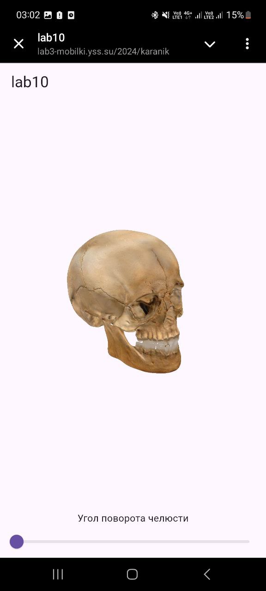
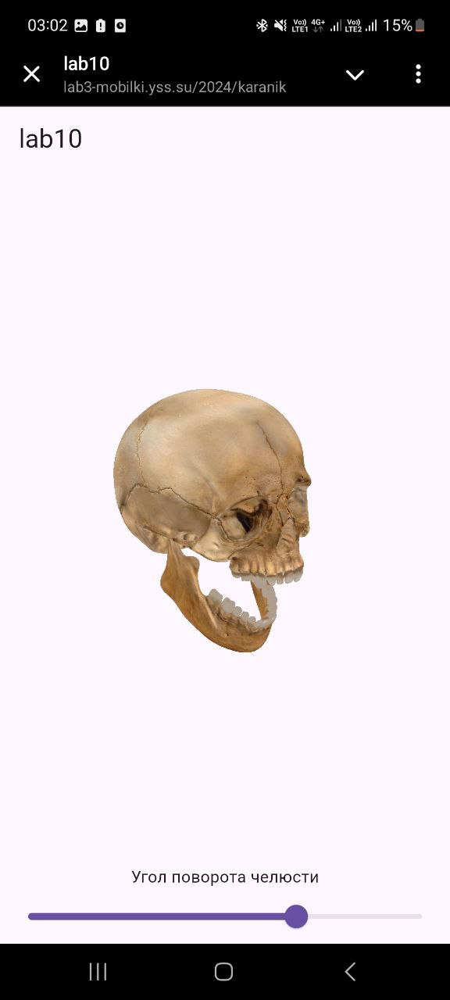

# Цель работы

Загрузить результаты лабораторной работы 10 на веб-сервер в свою директорию. Имя директории должно совпадать с фамилией стулента в латинице.

# Вариант 6

Реализовать приложение моделирования анимации челюсти черепа. Движение челюсти реализовать ползунком.

# Реализация

Исходный код:
```dart
import 'package:flutter/material.dart';
import 'package:flutter_cube/flutter_cube.dart';

void main() => runApp(const MyApp());

class MyApp extends StatelessWidget {
  const MyApp({super.key});

  @override
  Widget build(BuildContext context) {
    return const MaterialApp(
      title: 'lab10',
      home: Lab10StatefulWidget(),
      debugShowCheckedModeBanner: false,
    );
  }
}

class Lab10StatefulWidget extends StatefulWidget {
  const Lab10StatefulWidget({super.key});

  @override
  State<Lab10StatefulWidget> createState() => _Lab10StatefulWidgetState();
}

class _Lab10StatefulWidgetState extends State<Lab10StatefulWidget> {
  late Object skull;
  late Object jaw;
  double jawRotation = 0.0;

  @override
  Widget build(BuildContext context) {
    return Scaffold(
      appBar: AppBar(title: const Text('lab10')),
      body: Column(
        children: [
          Expanded(
            child: Center(
              child: Cube(
                onSceneCreated: (Scene scene) {
                  skull = Object(fileName: 'assets/skull/skull_without_jaw.obj');
                  scene.world.add(skull);
                  jaw = Object(fileName: 'assets/skull/jaw.obj');
                  jaw.scale.setValues(0.5, 0.5, 0.5);
                  jaw.position.setValues(0, 0.03, 0);
                  jaw.updateTransform();
                  scene.world.add(jaw);
                },
              ),
            ),
          ),
          Text(
            'Угол поворота челюсти'
          ),
          Slider(
            value: jawRotation,
            min: 0.0,
            max: 45.0,
            label: jawRotation.toStringAsFixed(2),
            onChanged: (value) {
              setState(() {
                jawRotation = value;
                jaw.rotation.setValues(jawRotation, 0, 0);
                jaw.updateTransform();
              });
            },
          ),
        ],
      ),
    );
  }
}

```

# Результаты

{width=5cm}

{width=5cm}

# Вывод

В ходе выполнения лабораторной работы было успешно реализовано приложение на веб-сервере, выводящее трехмерный объект, а именно череп с анимированной челюстью.