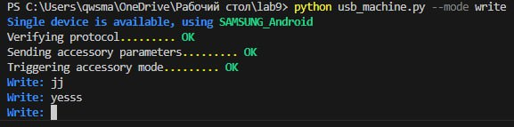
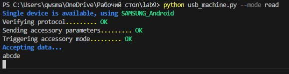
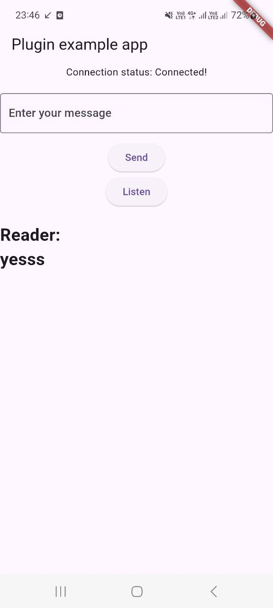
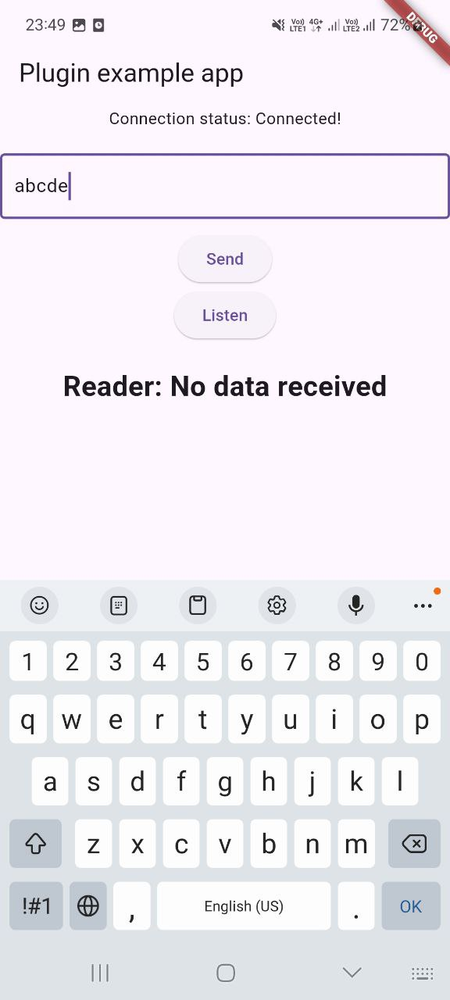

# Цель работы

Подключить смартфон к компьютеру через USB и реализовать обмен данными (write/read) с использованием Flutter и Python.

# Реализация

Исходный код main.dart:
```dart
import 'package:flutter/material.dart';
import 'dart:async';

import 'package:flutter/services.dart';
import 'package:usblibforelisey/usblibforelisey.dart';

void main() {
  runApp(const MyApp());
}

class MyApp extends StatefulWidget {
  const MyApp({super.key});

  @override
  State<MyApp> createState() => _MyAppState();
}

class _MyAppState extends State<MyApp> {
  String _connectionStatus = 'Unknown';
  String _readData = 'No data received';
  TextEditingController _textEditingController = TextEditingController();
  final _usblibforeliseyPlugin = Usblibforelisey();

  @override
  void initState() {
    super.initState();
    initPlatformState();
  }

  Future<void> initPlatformState() async {
    String connectionStatus;
    try {
      connectionStatus = await status();
    } catch (e) {
      connectionStatus = 'Some error!';
    }

    if (!mounted) return;

    setState(() {
      _connectionStatus = connectionStatus;
    });

    if (connectionStatus == 'Connected!'){
      return;
    }

    await Future.delayed(Duration(seconds: 1));
    await initPlatformState();
  }

  Future<String> status() async {
    var hasAccessory = await _usblibforeliseyPlugin.hasAccessoryConnected();
    if (!hasAccessory) {
      return 'No devices';
    }

    var hasPermission = await _usblibforeliseyPlugin.hasPermission(0);
    if (!hasPermission) {
      await _usblibforeliseyPlugin.requestPermission(0);
      return 'No permission!';
    }

    await _usblibforeliseyPlugin.connect(0);
    return 'Connected!';
  }

  Future<void> read() async {
    var data = await _usblibforeliseyPlugin.read();
    setState(() {
      _readData = String.fromCharCodes(data);
    });

    await Future.delayed(const Duration(milliseconds: 500));
    await read();
  }

  @override
  Widget build(BuildContext context) {
    return MaterialApp(
      home: Scaffold(
        appBar: AppBar(
          title: const Text('Plugin example app'),
        ),
        body: Center(
          child: Column(
            children: [
              Text('Connection status: $_connectionStatus\n'),
              TextField(
                controller: _textEditingController,
                decoration: const InputDecoration(
                  hintText: 'Enter your message',
                  border: OutlineInputBorder(),
                ),
              ),
              const SizedBox(height: 10),
              ElevatedButton(
                onPressed: () async {
                  if (_textEditingController.text.isEmpty) {
                    return;
                  }

                  await _usblibforeliseyPlugin.write(Uint8List.fromList(
                      _textEditingController.text.codeUnits));
                  return;
                },
                child: const Text('Send'),
              ),

              ElevatedButton(
                onPressed: () async {
                  await read();
                },
                child: const Text('Listen'),
              ),
              const SizedBox(height: 20),

              Text(
                'Reader: $_readData',
                style: const TextStyle(fontSize: 24, fontWeight: FontWeight.bold),
              ),
            ],
          ),
        ),
      ),
    );
  }
}

```

Исходный код usb_machine.py:
```python
import os
import platform
import time
from dataclasses import dataclass, field
from enum import Enum
from typing import Optional
import serial, time
from serial.tools import list_ports

import typer
from rich.console import Console
import sys

import usb
from usb.core import Device, Endpoint

# import usb.core
# import usb.backend.libusb1
# backend = usb.backend.libusb1.get_backend(find_library=lambda x: "/usr/lib/usb")

if platform.system() == "Darwin" and "arm" in platform.platform():
    os.environ["DYLD_LIBRARY_PATH"] = "/opt/homebrew/lib"


class AppMode(Enum):
    Write = "write"
    Read = "read"
    # WriteArduino = 'write-arduino'


@dataclass
class App:
    device: Optional[Device] = None
    console: Optional[Console] = field(default_factory=Console)

    def select_device(self):
        lst: list[usb.Device] = list(usb.core.find(find_all=True))
        if not lst:
            self.console.print(r"[bold blue]Waiting for devices...")
            while not lst:
                lst = list(usb.core.find(find_all=True))
                time.sleep(1)

        if len(lst) == 1:
            dev = lst[0]
            self.console.print(
                rf"[bold blue]Single device is available, using [bold green]{usb.util.get_string(dev, dev.iProduct)}"
            )
        else:
            self.console.print("[bold blue]Available devices:")
            for i, dev in enumerate(lst):
                try:
                    self.console.print(
                        f"  [bold green][{i}] {usb.util.get_string(dev, dev.iProduct)}"
                    )
                except ValueError as e:
                    pass
            ind = self.console.input("[bold blue]Select device index: ")
            dev = lst[int(ind)]

        self.device = dev

    def prepare_device(self):
        for command_name, command in [
            ("Verifying protocol", self.set_protocol),
            ("Sending accessory parameters", self.send_accessory_parameters),
            ("Triggering accessory mode", self.set_accessory_mode),
        ]:
            self.console.print(f"{command_name}......... ", end="")
            try:
                command()
            except:
                self.console.print("[bold red]FAIL")
                self.console.print_exception()
                sys.exit(1)
            else:
                self.console.print("[bold green]OK")

    def set_protocol(self):
        try:
            print(f"Устройство найдено: {self.device}")
            self.device.set_configuration()
        except usb.core.USBError as e:
            if e.errno != 16:  # 16 == already configured
                raise

        ret = self.device.ctrl_transfer(0xC0, 51, 0, 0, 2)
        protocol = ret[0]
        if protocol < 2:
            raise ValueError(f"Protocol version {protocol} < 2 is not supported")
        return

    def send_accessory_parameters(self):
        def send_string(str_id, str_val):
            ret = self.device.ctrl_transfer(0x40, 52, 0, str_id, str_val, 0)
            if ret != len(str_val):
                raise ValueError("Received non-valid response")
            return

        send_string(0, "dvpashkevich")
        send_string(1, "PyAndroidCompanion")
        send_string(2, "A Python based Android accessory companion")
        send_string(3, "0.1.0")
        send_string(4, "https://github.com/alien-agent/USB-Communicator-Script")
        send_string(5, "0000-0000-0000")
        return

    def set_accessory_mode(self):
        ret = self.device.ctrl_transfer(0x40, 53, 0, 0, "", 0)
        if ret:
            raise ValueError("Failed to trigger accessory mode")
        time.sleep(1)

        # Must reconnect
        dev = usb.core.find()
        if not dev:
            raise ValueError(
                "Device gone missing after accessory mode trigger, please restart"
            )
        self.device = dev

        return

    def accept_data(self):
        self.console.print("[bold blue]Accepting data...")
        cfg = self.device.get_active_configuration()
        if_num = cfg[(0, 0)].bInterfaceNumber
        intf = usb.util.find_descriptor(cfg, bInterfaceNumber=if_num)

        ep_in: Endpoint = usb.util.find_descriptor(
            intf,
            custom_match=lambda e: usb.util.endpoint_direction(e.bEndpointAddress)
            == usb.util.ENDPOINT_IN,
        )
        while True:
            try:
                data = ep_in.read(size_or_buffer=1024, timeout=0)
                print(bytes(data).decode())
            except usb.core.USBError as e:
                print("failed to send IN transfer")
                print(e)
                break
            except KeyboardInterrupt:
                self.console.print("Disconnecting device......... ")
                self.device.detach_kernel_driver(0)

    def write(self):
        cfg = self.device.get_active_configuration()
        if_num = cfg[(0, 0)].bInterfaceNumber
        intf = usb.util.find_descriptor(cfg, bInterfaceNumber=if_num)

        ep_out: Endpoint = usb.util.find_descriptor(
            intf,
            custom_match=lambda e: usb.util.endpoint_direction(e.bEndpointAddress)
            == usb.util.ENDPOINT_OUT,
        )
        while True:
            message = self.console.input("[bold blue]Write: ")
            ep_out.write(message)

    def write_arduino(self):
        ports = list(serial.tools.list_ports.comports())
        target_port = None
        for p in ports:
            if "usb" in str(p.usb_info()).lower():
                target_port = p
        if target_port is None:
            self.console.print("[bold red]No USB ports found!")
            sys.exit(1)
        self.console.print(f"[bold blue]Writing to {target_port.device}")

        while True:
            user_input = input()
            if user_input in ["0", "1"]:
                with serial.Serial(target_port.device, 9600) as ser:
                    ser.write(user_input.encode())


def main(mode: AppMode = AppMode.Read.value):
    app = App()
    # if mode == AppMode.WriteArduino:
    #     app.write_arduino()
    # else:
    app.select_device()
    app.prepare_device()

    if mode == AppMode.Write:
        app.write()
    else:
        app.accept_data()


if __name__ == "__main__":
    typer.run(main)

```

# Результаты

{width=10cm}

{width=10cm}

{width=5cm}

{width=5cm}

# Вывод

В ходе выполнения лабораторной работы было успешно настроено взаимодействие смартфона и компьютера по USB. Реализован обмен данными через Flutter-приложение и Python-скрипт.