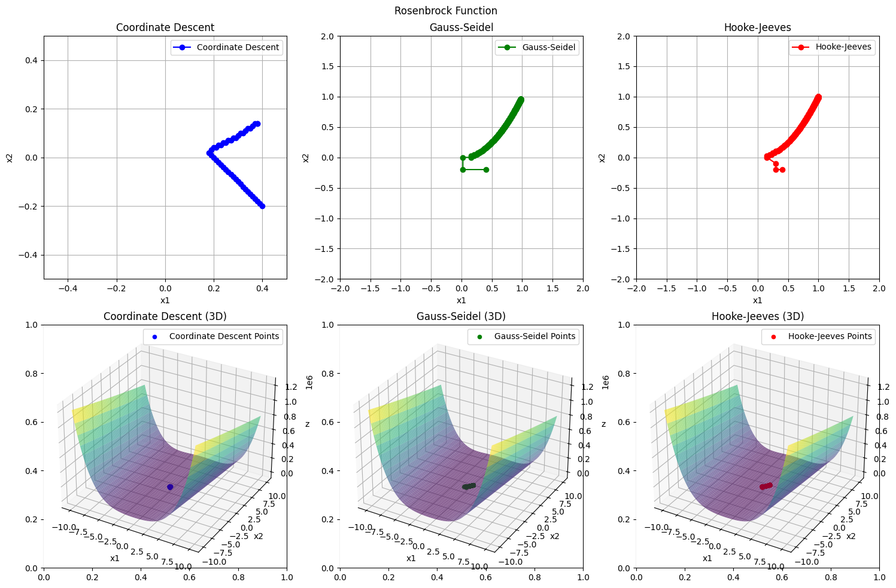
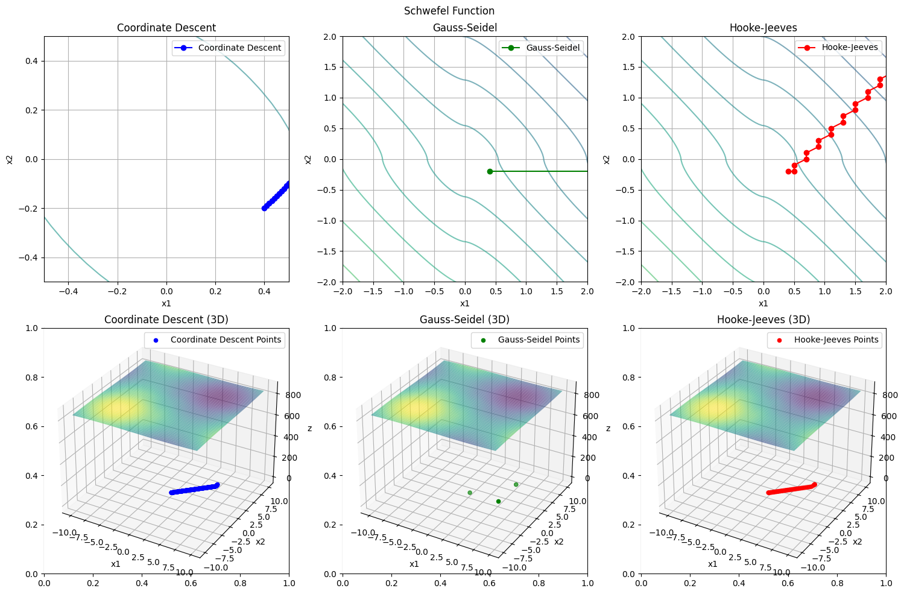
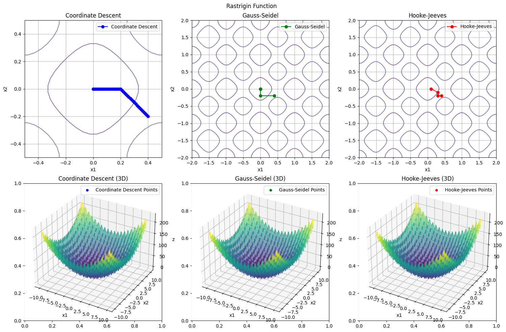

# Цель работы

Целью данной лабораторной работы является визуализация траекторий, которые проходят методы оптимизации (покоординатного спуска, Гаусса-Зейделя, Хука-Дживса) на контурных и 3D-графиках для различных функций. Это поможет лучше понять, как эти методы работают и как они сходятся к минимуму для разных типов функций, таких как Розенброка, Швефеля и Растригина.

# Реализация

Исходный код:
```julia
using LinearAlgebra
using CSV
using DataFrames

function coordinate_descent(f, x0; step_size=0.01, tol=1e-6, max_iter=10000)
    x = copy(x0)
    n = length(x0)
    iter_count = 0
    iter_vectors = [vcat(x, f(x))]
    
    for iter in 1:max_iter
        x_old = copy(x)

        for i in 1:n
            f_current = f(x)
            x_forward = copy(x); x_forward[i] += step_size
            x_backward = copy(x); x_backward[i] -= step_size

            f_forward = f(x_forward)
            f_backward = f(x_backward)

            if f_forward < f_current && f_forward <= f_backward
                x[i] += step_size
            elseif f_backward < f_current
                x[i] -= step_size
            end
        end

        push!(iter_vectors, vcat(x, f(x)))
        
        if norm(x - x_old) < tol
            iter_count = iter
            break
        end
    end
    
    println("Число итераций метода покоординатного спуска: ", iter_count)
    return x, iter_vectors
end

# Функция обратного переменного шага для поиска оптимального α
function reverse_variable_step(f, x, e; Δ0=1.0, β=0.5, tol=1e-6, max_iter=10000)
    α0 = 0.0
    α1 = Δ0
    y0 = f(x + α0 * e)
    y1 = f(x + α1 * e)
    iter_count = 0

    for k in 1:max_iter
        if abs(y0 - y1) < tol
            iter_count = k
            break
        elseif y0 > y1
            α0, y0 = α1, y1
            α1 = α1 + Δ0
            y1 = f(x + α1 * e)
        else
            Δ0 *= -β
            α1 = α0 + Δ0
            y1 = f(x + α1 * e)
        end
    end
    return (α0 + α1) / 2
end

function gauss_seidel(f, x0; tol=1e-6, max_iter=10000)
    x = copy(x0)
    n = length(x)
    iter_count = 0
    iter_vectors = [vcat(x, f(x))]

    for k in 1:max_iter
        x_prev = copy(x)

        for i in 1:n
            e = zeros(n)
            e[i] = 1  # Единичный вектор вдоль i-й координаты
            
            # Оптимизируем по α
            α_opt = reverse_variable_step(f, x, e)
            x += α_opt * e
            push!(iter_vectors, vcat(x, f(x)))
        end

        if norm(f(x_prev) - f(x)) < tol
            iter_count = k
            break
        end
    end
    println("Число итераций метода Гаусса-Зейделя: ", iter_count)
    return x, iter_vectors
end

function hooke_jeeves(f, x0; Δ=0.1, β=0.5, tol=1e-6, max_iter=10000)
    x = copy(x0)
    n = length(x)
    Δx = fill(Δ, n)  # Вектор шагов по каждой координате
    iter_count = 0
    iter_vectors = [vcat(x, f(x))]

    while maximum(abs.(Δx)) > tol && iter_count < max_iter
        x_prev = copy(x)
        x_new = copy(x)
        a = 0

        # Исследующий поиск
        for i in 1:n
            x_test = copy(x_new)
            x_test[i] += Δx[i]
            if f(x_test) < f(x_new)
                x_new = x_test
                push!(iter_vectors, vcat(x_new, f(x_new)))
            else
                x_test[i] = x_new[i] - Δx[i]  # Пробуем в другую сторону
                if f(x_test) < f(x_new)
                    x_new = x_test
                    push!(iter_vectors, vcat(x_new, f(x_new)))
                end
            end
        end

        if x_new == x  # Если все шаги неудачны
            Δx *= β   # Уменьшаем шаги
        else
            # Движение по образцу
            x = 2 * x_new - x_prev
            if f(x) > f(x_new)  # Если движение по образцу не уменьшает f
                x = x_new  # Оставляем только исследующий поиск
            end
        end

        iter_count += 1
    end
    println("Число итераций метода Хука-Дживса: ", iter_count)
    return x, iter_vectors
end

function rosenbrock(x)
    return (1 - x[1])^2 + 100 * (x[2] - x[1]^2)^2
end

function schwefel(x1, x2)
    return 418.9829 * 2 - (x1 * sin(sqrt(abs(x1))) + x2 * sin(sqrt(abs(x2))))
end

function rastrigin(x)
    return 20 + sum(x.^2 .- 10 * cos.(2 * π * x))
end
function save_trajectory_to_file(traj, filename)
    CSV.write(filename, DataFrame(x1=[point[1] for point in traj], x2=[point[2] for point in traj], x3=[point[3] for point in traj]))
end

x0 = [0.4, -0.2]  
true_minimum = [1.0, 1.0] 

println("\n--- Покоординатный спуск для Розенброка ---")
@time xmin_cd, traj_cd = coordinate_descent(rosenbrock, x0)
println("Минимум найден в точке: ", xmin_cd)
println("Погрешность: ", norm(xmin_cd - true_minimum))

println("\n--- Гаусс-Зейдель для Розенброка ---")
@time xmin_gs, traj_gs = gauss_seidel(rosenbrock, x0)
println("Минимум найден в точке: ", xmin_gs)
println("Погрешность: ", norm(xmin_gs - true_minimum))

println("\n--- Хук-Дживс для Розенброка ---")
@time xmin_hj, traj_hj = hooke_jeeves(rosenbrock, x0)
println("Минимум найден в точке: ", xmin_hj)
println("Погрешность: ", norm(xmin_hj - true_minimum))

save_trajectory_to_file(traj_cd, "traj_cd_rosenbrock.csv")
save_trajectory_to_file(traj_gs, "traj_gs_rosenbrock.csv")
save_trajectory_to_file(traj_hj, "traj_hj_rosenbrock.csv")

println("\n--- Покоординатный спуск для Швефеля ---")
@time xmin_cd, traj_cd = coordinate_descent(schwefel, x0)
println("Минимум найден в точке: ", xmin_cd)

println("\n--- Гаусс-Зейдель для Швефеля ---")
@time xmin_gs, traj_gs = gauss_seidel(schwefel, x0)
println("Минимум найден в точке: ", xmin_gs)

println("\n--- Хук-Дживс для Швефеля ---")
@time xmin_hj, traj_hj = hooke_jeeves(schwefel, x0)
println("Минимум найден в точке: ", xmin_hj)

save_trajectory_to_file(traj_cd, "traj_cd_schwefel.csv")
save_trajectory_to_file(traj_gs, "traj_gs_schwefel.csv")
save_trajectory_to_file(traj_hj, "traj_hj_schwefel.csv")

println("\n--- Покоординатный спуск для Растригина ---")
@time xmin_cd, traj_cd = coordinate_descent(rastrigin, x0)
println("Минимум найден в точке: ", xmin_cd)

println("\n--- Гаусс-Зейдель для Растригина ---")
@time xmin_gs, traj_gs = gauss_seidel(rastrigin, x0)
println("Минимум найден в точке: ", xmin_gs)

println("\n--- Хук-Дживс для Растригина ---")
@time xmin_hj, traj_hj = hooke_jeeves(rastrigin, x0)
println("Минимум найден в точке: ", xmin_hj)

save_trajectory_to_file(traj_cd, "traj_cd_rastrigin.csv")
save_trajectory_to_file(traj_gs, "traj_gs_rastrigin.csv")
save_trajectory_to_file(traj_hj, "traj_hj_rastrigin.csv")

```

```python
import matplotlib.pyplot as plt
import pandas as pd
import numpy as np
from mpl_toolkits.mplot3d import Axes3D

traj_cd_rosenbrock = pd.read_csv("traj_cd_rosenbrock.csv")
traj_gs_rosenbrock = pd.read_csv("traj_gs_rosenbrock.csv")
traj_hj_rosenbrock = pd.read_csv("traj_hj_rosenbrock.csv")

traj_cd_schwefel = pd.read_csv("traj_cd_schwefel.csv")
traj_gs_schwefel = pd.read_csv("traj_gs_schwefel.csv")
traj_hj_schwefel = pd.read_csv("traj_hj_schwefel.csv")

traj_cd_rastrigin = pd.read_csv("traj_cd_rastrigin.csv")
traj_gs_rastrigin = pd.read_csv("traj_gs_rastrigin.csv")
traj_hj_rastrigin = pd.read_csv("traj_hj_rastrigin.csv")

def rosenbrock(x1, x2):
    return (1 - x1)**2 + 100 * (x2 - x1**2)**2

def schwefel(x1, x2):
    return 418.9829 * 2 - (x1 * np.sin(np.sqrt(np.abs(x1))) + x2 * np.sin(np.sqrt(np.abs(x2))))

def rastrigin(x1, x2):
    return 20 + x1**2 - 10 * np.cos(2 * np.pi * x1) + x2**2 - 10 * np.cos(2 * np.pi * x2)

def plot_trajectory_on_contours_and_3d(traj_cd, traj_gs, traj_hj, title, func):
    fig, ax = plt.subplots(2, 3, figsize=(15, 10))

    x1_range = np.linspace(-10, 10, 400)
    x2_range = np.linspace(-10, 10, 400)
    X1, X2 = np.meshgrid(x1_range, x2_range)
    Z = func(X1, X2)

    ax[0, 0].contour(X1, X2, Z, levels=20, cmap='viridis', alpha=0.6)
    ax[0, 0].plot(traj_cd['x1'], traj_cd['x2'], marker='o', linestyle='-', color='b', label='Coordinate Descent')
    ax[0, 0].set_title("Coordinate Descent")
    ax[0, 0].set_xlabel('x1')
    ax[0, 0].set_ylabel('x2')
    ax[0, 0].grid(True)
    ax[0, 0].legend()
    ax[0, 0].set_xlim(-0.5, 0.5)
    ax[0, 0].set_ylim(-0.5, 0.5)

    ax[0, 1].contour(X1, X2, Z, levels=20, cmap='viridis', alpha=0.6)
    ax[0, 1].plot(traj_gs['x1'], traj_gs['x2'], marker='o', linestyle='-', color='g', label='Gauss-Seidel')
    ax[0, 1].set_title("Gauss-Seidel")
    ax[0, 1].set_xlabel('x1')
    ax[0, 1].set_ylabel('x2')
    ax[0, 1].grid(True)
    ax[0, 1].legend()
    ax[0, 1].set_xlim(-2.0, 2.0)
    ax[0, 1].set_ylim(-2.0, 2.0)

    ax[0, 2].contour(X1, X2, Z, levels=20, cmap='viridis', alpha=0.6)
    ax[0, 2].plot(traj_hj['x1'], traj_hj['x2'], marker='o', linestyle='-', color='r', label='Hooke-Jeeves')
    ax[0, 2].set_title("Hooke-Jeeves")
    ax[0, 2].set_xlabel('x1')
    ax[0, 2].set_ylabel('x2')
    ax[0, 2].grid(True)
    ax[0, 2].legend()
    ax[0, 2].set_xlim(-2.0, 2.0)
    ax[0, 2].set_ylim(-2.0, 2.0)

    ax3d = fig.add_subplot(2, 3, 4, projection='3d')
    X1_3d, X2_3d = np.meshgrid(x1_range, x2_range)
    Z_3d = func(X1_3d, X2_3d)
    ax3d.plot_surface(X1_3d, X2_3d, Z_3d, cmap='viridis', alpha=0.6)
    ax3d.scatter(traj_cd['x1'], traj_cd['x2'], 0, color='b', label='Coordinate Descent Points')
    ax3d.set_title("Coordinate Descent (3D)")
    ax3d.set_xlabel('x1')
    ax3d.set_ylabel('x2')
    ax3d.set_zlabel('z')
    ax3d.legend()

    ax3d = fig.add_subplot(2, 3, 5, projection='3d')
    Z_3d = func(X1_3d, X2_3d)
    ax3d.plot_surface(X1_3d, X2_3d, Z_3d, cmap='viridis', alpha=0.6)
    ax3d.scatter(traj_gs['x1'], traj_gs['x2'], 0, color='g', label='Gauss-Seidel Points')
    ax3d.set_title("Gauss-Seidel (3D)")
    ax3d.set_xlabel('x1')
    ax3d.set_ylabel('x2')
    ax3d.set_zlabel('z')
    ax3d.legend()

    ax3d = fig.add_subplot(2, 3, 6, projection='3d')
    Z_3d = func(X1_3d, X2_3d)
    ax3d.plot_surface(X1_3d, X2_3d, Z_3d, cmap='viridis', alpha=0.6)
    ax3d.scatter(traj_hj['x1'], traj_hj['x2'], 0, color='r', label='Hooke-Jeeves Points')
    ax3d.set_title("Hooke-Jeeves (3D)")
    ax3d.set_xlabel('x1')
    ax3d.set_ylabel('x2')
    ax3d.set_zlabel('z')
    ax3d.legend()

    fig.suptitle(title)

    plt.tight_layout()
    plt.subplots_adjust(top=0.93)
    plt.show()

plot_trajectory_on_contours_and_3d(traj_cd_rosenbrock, traj_gs_rosenbrock, traj_hj_rosenbrock, "Rosenbrock Function", rosenbrock)
plot_trajectory_on_contours_and_3d(traj_cd_schwefel, traj_gs_schwefel, traj_hj_schwefel, "Schwefel Function", schwefel)
plot_trajectory_on_contours_and_3d(traj_cd_rastrigin, traj_gs_rastrigin, traj_hj_rastrigin, "Rastrigin Function", rastrigin)

```

# Результаты

{width=10cm}

{width=10cm}

{width=10cm}

# Вывод

На основании полученных графиков можно сделать следующие выводы: метод покоординатного спуска показывает относительно медленное приближение к минимуму, но может быть более эффективным для некоторых функций Метод Гаусса-Зейделя демонстрирует более быстрый процесс оптимизации по сравнению с покоординатным спуском, но также зависит от формы функции. Метод Хука-Дживса показывает более гладкие траектории и имеет хорошие результаты на многих функциях. Визуализация в виде контурных и 3D-графиков помогает наглядно продемонстрировать поведение различных методов оптимизации и их способность находить оптимальные точки.